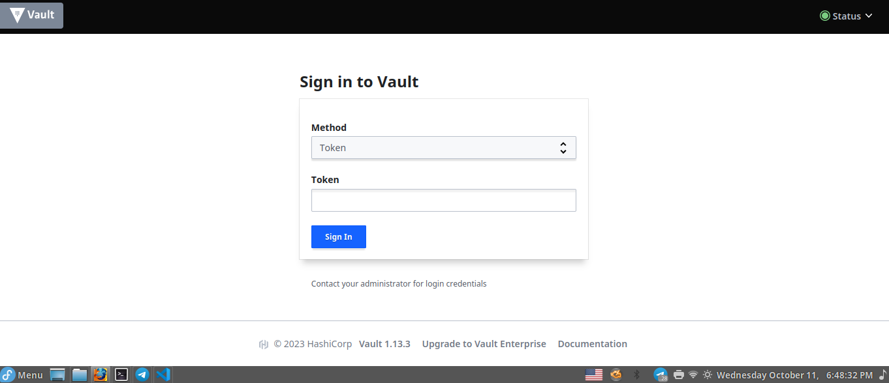
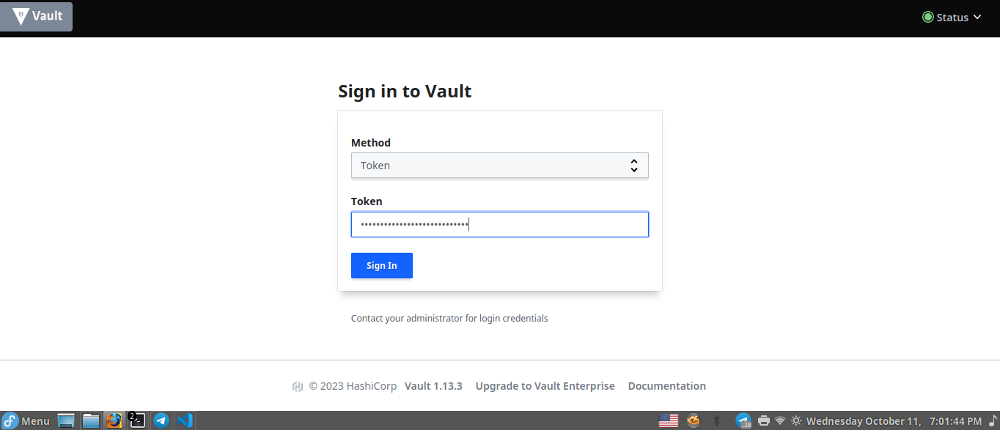
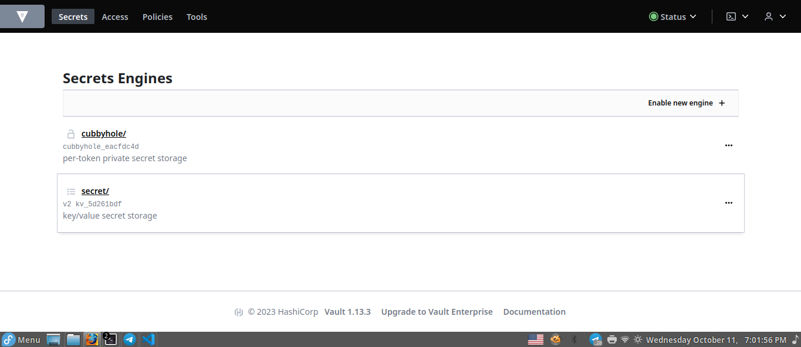
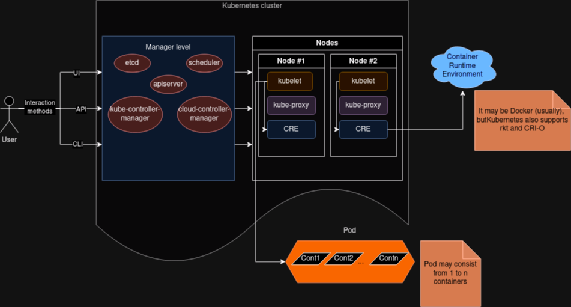

# Laboratory work #1

## Installing Docker and Minikube. My First Manifest

University: [ITMO University](https://itmo.ru/ru/)

Faculty: [FICT](https://fict.itmo.ru)

Course: [Introduction to distributed technologies](https://github.com/itmo-ict-faculty/introduction-to-distributed-technologies)

Year: 2023/2024

Group: K4110c

Author: Semykin Vladislav Denisovich

Lab: Lab1

Date of create: 04.09.2023

Date of finished: 20.10.2023

## Description

This is the first laboratory work in which you will be able to test Docker, install Minikube and deploy your first pod-shell.

## Aim

Familiarize with the Minikube and Docker tools, deploy your first pod-shell.

## Progress of a work

### Downloading && Installing

For download [minikube](https://minikube.sigs.k8s.io/) used following command:

```console
curl -LO https://storage.googleapis.com/minikube/releases/latest/minikube-latest.x86_64.rpm
```

Mean of flag <b>-L</b>: If the server reports that the requested page has moved to a different location (indicated with a Location: header and a 3XX response code), this option will make curl redo the request on the new place.

Mean of flag <b>-O</b>: Write output to a local file named like the remote file we get. The file will be saved in the current working directory.

Command to install minikube for my system (6.4.12-200.fc38.x86_64):

```console
sudo rpm -Uvh minikube-latest.x86_64.rpm
```

Mean of flag <b>-U</b>: Upgrades package

Mean of flag <b>-v</b>: Print verbose information - normally routine progress messages will be displayed.

Mean of flag <b>-h</b>: Print 50 hash marks as the package archive is unpacked.

### Getting started with <b>minikube</b>

After installation we need to deploy an one-node Kubernetes cluster with the following command:

> If appears window that requires root password, just close it or push "Cancel". Because the driver "kvm2" should not be installed with root priviliges.

```bash
minikube start --kubernetes-version=v1.26.8
```

This command starts cluster with the specified Kubernetes version: The Kubernetes version that the minikube VM will use (ex: v1.2.3, 'stable' for v1.27.4, 'latest' for v1.28.0-rc.1). Defaults to 'stable'.

I choose the latest version on my OS.

### Downloading docker image

For example, we have been choose [HashiCorp Vault](https://www.vaultproject.io/). Command to [download](https://hub.docker.com/_/vault/) it:

```bash
sudo docker pull hashicorp/vault:1.13.3
```

As you can see, I chose 1.13.3 version. The colon (:) serves to specify tag of the image.
Starting the Docker container with HashiCorp Vault:

```bash
sudo docker run -d --name hashicorp-vault-container hashicorp/vault:1.13.3
```

Possible output of container ID:

```console
5cb6be01dee1183e95278a87c4a27ecd5f6b8968048bba0971e6ba0b039dd3bc
```

Execute following command to show a list of all containers:

```bash
sudo docker ps -a
```

Output:

```console
CONTAINER ID   IMAGE                    COMMAND                  CREATED         STATUS              PORTS      NAMES
5cb6be01dee1   hashicorp/vault:1.13.3   "docker-entrypoint.s…"   2 minutes ago   Up About a minute   8200/tcp   hashicorp-vault-contain
```

> Do not forget for start docker service with the following command:
>
> ```bash
> sudo service docker start
> ```

### Deploying minikube cluster

To deploy cluster we need to use the following command:

```bash
minikube start
```

The output might be follows:

```console
<loveit@fedora 2023_2024-intoduction_to_distributed_technologies-k4110-semykin-v-d>$ minikube start
😄  minikube v1.31.2 on Fedora 38
🆕  Kubernetes 1.27.4 is now available. If you would like to upgrade, specify: --kubernetes-version=v1.27.4
✨  Using the qemu2 driver based on existing profile
👍  Starting control plane node minikube in cluster minikube
💾  Downloading Kubernetes v1.26.8 preload ...
    > preloaded-images-k8s-v18-v1...:  400.63 MiB / 400.63 MiB  100.00% 3.71 Mi
🔄  Restarting existing qemu2 VM for "minikube" ...
❗  This VM is having trouble accessing https://registry.k8s.io
💡  To pull new external images, you may need to configure a proxy: https://minikube.sigs.k8s.io/docs/reference/networking/proxy/
❗  Due to DNS issues your cluster may have problems starting and you may not be able to pull images
More details available at: https://minikube.sigs.k8s.io/docs/drivers/qemu/#known-issues
🐳  Preparing Kubernetes v1.26.8 on Docker 24.0.4 ...
🔗  Configuring bridge CNI (Container Networking Interface) ...
    ▪ Using image gcr.io/k8s-minikube/storage-provisioner:v5
🔎  Verifying Kubernetes components...
🌟  Enabled addons: storage-provisioner, default-storageclass
🏄  Done! kubectl is now configured to use "minikube" cluster and "default" namespace by default
```

After starting the minikube cluster we can interoperate with the <b>k8s</b> using the following command:

```bash
minikube kubectl
```

> Using minikube kubectl is necessary if kubectl has not been installed on your system (this is not provided in the minikube installation instructions), kubectl is a tool for managing a regular k8s cluster and is installed separately. For ease of use, you can create an alias alias kubectl="minikube kubectl --" or similar at your discretion, but this is not necessary.

Viewing images in Docker:

```bash
sudo docker image ls
```

Output:

```console
REPOSITORY        TAG       IMAGE ID       CREATED        SIZE
hashicorp/vault   1.13.3    9e622613a2d5   4 months ago   253MB
hello-world       latest    9c7a54a9a43c   5 months ago   13.3kB
```

Creating deployment of hashicorp Vault:

```bash
kubectl create deployment vault --image=hashicorp/vault:1.13.3
```

Output:

```console
deployment.apps/vault created
```

Creating service with port 8200:

```bash
kubectl expose deployment vault --type=NodePort --port=8200
```

Output:

```console
service/vault exposed
```

Forwarding to the docker container with Hashi Corp:

```bash
kubectl port-forward service/vault 8200:8200
```

Now, we can move to http://localhost:8200 and there would be this window:



Possible output:

```console
Forwarding from 127.0.0.1:8200 -> 8200
Forwarding from [::1]:8200 -> 8200
Handling connection for 8200
Handling connection for 8200
Handling connection for 8200
Handling connection for 8200
Handling connection for 8200
```

## Questions & Answers

#### Questions 1

1. What happened now and what did the commands mentioned earlier do?

#### Answer

1. Minikube was installed.
2. Downloaded a Docker image of HashiCorp Vault.
3. Minikube cluster deployed.
4. Deployed a HashiCorp Vault pod inside the Minikube cluster.
5. Exposed HashiCorp Vault pod as a service, making it accessible from outside.
6. Set up port forwarding, that allows to access the HashiCorp Vault service on local machine.

#### Question 2

2. Where can I get a token to enter the Vault?

#### Answer

The token can be found in logs as hint says. It's generating during the deployment of hashicorp Vault pod.
To view logs we need to execute the following command:

```bash
kubectl logs pods/vault-6c7bb4db6c-k9bqn
```

> vault-6c7bb4db6c-k9bqn has been found with <b>Tab</b> key on the keyboard. I don't know this exactly.

Possible output:

```console
Couldn't start vault with IPC_LOCK. Disabling IPC_LOCK, please use --cap-add IPC_LOCK
==> Vault server configuration:

             Api Address: http://0.0.0.0:8200
                     Cgo: disabled
         Cluster Address: https://0.0.0.0:8201
   Environment Variables: GODEBUG, HOME, HOSTNAME, KUBERNETES_PORT, KUBERNETES_PORT_443_TCP, KUBERNETES_PORT_443_TCP_ADDR, KUBERNETES_PORT_443_TCP_PORT, KUBERNETES_PORT_443_TCP_PROTO, KUBERNETES_SERVICE_HOST, KUBERNETES_SERVICE_PORT, KUBERNETES_SERVICE_PORT_HTTPS, NAME, PATH, PWD, SHLVL, VERSION
              Go Version: go1.20.4
              Listener 1: tcp (addr: "0.0.0.0:8200", cluster address: "0.0.0.0:8201", max_request_duration: "1m30s", max_request_size: "33554432", tls: "disabled")
               Log Level:
                   Mlock: supported: true, enabled: false
           Recovery Mode: false
                 Storage: inmem
                 Version: Vault v1.13.3, built 2023-06-06T18:12:37Z
             Version Sha: 3bedf816cbf851656ae9e6bd65dd4a67a9ddff5e

==> Vault server started! Log data will stream in below:

2023-10-11T15:38:25.334Z [INFO]  proxy environment: http_proxy="" https_proxy="" no_proxy=""
2023-10-11T15:38:25.335Z [WARN]  no `api_addr` value specified in config or in VAULT_API_ADDR; falling back to detection if possible, but this value should be manually set
2023-10-11T15:38:25.341Z [INFO]  core: Initializing version history cache for core
2023-10-11T15:38:25.348Z [INFO]  core: security barrier not initialized
2023-10-11T15:38:25.349Z [INFO]  core: security barrier initialized: stored=1 shares=1 threshold=1
2023-10-11T15:38:25.358Z [INFO]  core: post-unseal setup starting
2023-10-11T15:38:25.405Z [INFO]  core: loaded wrapping token key
2023-10-11T15:38:25.406Z [INFO]  core: successfully setup plugin catalog: plugin-directory=""
2023-10-11T15:38:25.406Z [INFO]  core: no mounts; adding default mount table
2023-10-11T15:38:25.411Z [INFO]  core: successfully mounted: type=cubbyhole version="v1.13.3+builtin.vault" path=cubbyhole/ namespace="ID: root. Path: "
2023-10-11T15:38:25.415Z [INFO]  core: successfully mounted: type=system version="v1.13.3+builtin.vault" path=sys/ namespace="ID: root. Path: "
2023-10-11T15:38:25.419Z [INFO]  core: successfully mounted: type=identity version="v1.13.3+builtin.vault" path=identity/ namespace="ID: root. Path: "
2023-10-11T15:38:25.432Z [INFO]  core: successfully mounted: type=token version="v1.13.3+builtin.vault" path=token/ namespace="ID: root. Path: "
2023-10-11T15:38:25.433Z [INFO]  rollback: starting rollback manager
2023-10-11T15:38:25.433Z [INFO]  core: restoring leases
2023-10-11T15:38:25.433Z [INFO]  expiration: lease restore complete
2023-10-11T15:38:25.434Z [INFO]  identity: entities restored
2023-10-11T15:38:25.434Z [INFO]  identity: groups restored
2023-10-11T15:38:25.435Z [INFO]  core: Recorded vault version: vault version=1.13.3 upgrade time="2023-10-11 15:38:25.435082289 +0000 UTC" build date=2023-06-06T18:12:37Z
2023-10-11T15:38:26.347Z [INFO]  core: post-unseal setup complete
2023-10-11T15:38:26.348Z [INFO]  core: root token generated
2023-10-11T15:38:26.348Z [INFO]  core: pre-seal teardown starting
2023-10-11T15:38:26.348Z [INFO]  rollback: stopping rollback manager
2023-10-11T15:38:26.348Z [INFO]  core: pre-seal teardown complete
2023-10-11T15:38:26.348Z [INFO]  core.cluster-listener.tcp: starting listener: listener_address=0.0.0.0:8201
2023-10-11T15:38:26.349Z [INFO]  core.cluster-listener: serving cluster requests: cluster_listen_address=[::]:8201
2023-10-11T15:38:26.349Z [INFO]  core: post-unseal setup starting
2023-10-11T15:38:26.349Z [INFO]  core: loaded wrapping token key
2023-10-11T15:38:26.349Z [INFO]  core: successfully setup plugin catalog: plugin-directory=""
2023-10-11T15:38:26.350Z [INFO]  core: successfully mounted: type=system version="v1.13.3+builtin.vault" path=sys/ namespace="ID: root. Path: "
2023-10-11T15:38:26.350Z [INFO]  core: successfully mounted: type=identity version="v1.13.3+builtin.vault" path=identity/ namespace="ID: root. Path: "
2023-10-11T15:38:26.350Z [INFO]  core: successfully mounted: type=cubbyhole version="v1.13.3+builtin.vault" path=cubbyhole/ namespace="ID: root. Path: "
2023-10-11T15:38:26.352Z [INFO]  core: successfully mounted: type=token version="v1.13.3+builtin.vault" path=token/ namespace="ID: root. Path: "
2023-10-11T15:38:26.352Z [INFO]  rollback: starting rollback manager
2023-10-11T15:38:26.352Z [INFO]  core: restoring leases
2023-10-11T15:38:26.352Z [INFO]  expiration: lease restore complete
2023-10-11T15:38:26.352Z [INFO]  identity: entities restored
2023-10-11T15:38:26.352Z [INFO]  identity: groups restored
2023-10-11T15:38:26.353Z [INFO]  core: post-unseal setup complete
2023-10-11T15:38:26.353Z [INFO]  core: vault is unsealed
2023-10-11T15:38:26.363Z [INFO]  core: successful mount: namespace="" path=secret/ type=kv version=""
WARNING! dev mode is enabled! In this mode, Vault runs entirely in-memory
and starts unsealed with a single unseal key. The root token is already
authenticated to the CLI, so you can immediately begin using Vault.

You may need to set the following environment variables:

    $ export VAULT_ADDR='http://0.0.0.0:8200'

The unseal key and root token are displayed below in case you want to
seal/unseal the Vault or re-authenticate.

Unseal Key: <YOUR UNSEAL KEY>
Root Token: <YOUR ROOT TOKEN>

Development mode should NOT be used in production installations!
```

As we can notice, there is <b>Root Token</b> with value <b><YOUR ROOT TOKEN></b> in this case. Hence, we can get access into the Vault:

Step 1: Entering the token



Step 2: Got access



## Manifest

There is the YAML file with description of pod details:

```yaml
apiVersion: v1
kind: Pod
metadata:
  name: vault
spec:
  containers:
    - name: hashicorp-vault-container
      image: hashicorp/vault:1.13.3
      ports:
        - containerPort: 8200
```

Creating "pod" with vault using following command:

```bash
kubectl apply -f manifest.yaml
```

Output:

```console
pod/vault created
```

Command to stop minikube cluster (run it in another terminal):

```bash
minikube stop
```

Scheme of Kubernetes architecture drew in [draw.io](https://app.diagrams.net/):



On this scheme we can see, that Kubernetes cluster consists of manager level and nodes. Manager level responds for all tasks that are requires by a Kubernetes: planning work of containers, service management, serving API-requests, etc. Likewise, manager level it is a comprehensive part that consist from several subparts:

### Members of manager level

1. <b>kube-apiserver</b>: external server for handling API-processing (thing that helps user interoperate with cluster).
2. <b>etcd</b>: database, where Kubernetes storaging all the information about existing nodes, cluster resources, ...
3. <b>kube-scheduler</b>: smth like task manager that declares where to run freshly created pods.
4. <b>kube-controller-manager</b>: responsible for starting resource controllers (for example, deployment).
5. <b>cloud-controller-manager</b>: interacts with cloud provider (in cloud clusters).

### Members of node

1. <b>kubelet</b>: manages container runtime environment (thus, we can suppose, that it addresses to pod directly, so, I add an arrow from the <b>kubelet</b> to <b>pod</b> as a relation). And added an arrow from <b>kubelet</b> to <b>CRE</b> that stands for <b>container runtime environment</b> to empasize the relation between them.
2. <b>kube-proxy</b>: spread requests between pods on different nodes and between pods and Internet.
3. <b>CRE</b>: starts/stops containers, responsible for their interoperations. As I noticed on the scheme, usually CRE = Docker, but Kubernetes also supports other CREs, for example: [rkt](https://www.redhat.com/en/topics/containers/what-is-rkt) or [CRI-O](https://cri-o.io/), or [click here](https://habr.com/ru/companies/flant/articles/340010/) for CRI-O.

## Conclusion

In this laboratory work, I embarked on a journey to explore the foundational aspects of Kubernetes, with a focus on installing Docker and Minikube, and deploying my first pod. The goal was to gain familiarity with these essential tools and take the first steps in the Kubernetes world.<p>
I researched the architecture of Kubernetes, of its components and how they do their work, that is reflects in scheme of Kubernetes architecture that provided above. Likewise, this work implies writing of the manifest that used to start Kubernetes pod that uses Docker image with HashiCorp Vault. To get access into container I used https://localhost:8200, where 8200 is port of container and also port of the host (my PC):

```bash
kubectl port-forward service/vault 8200:8200
kubectl port-forward service/vault HOST_PORT:CONTAINER_PORT
```

To get access to the Vault I needed to check logs which I get by the following command:

```bash
kubectl logs pods/vault-6c7bb4db6c-k9bqn
```

In these log messages we can find token to get authorized into the Vault.
