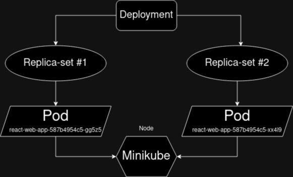
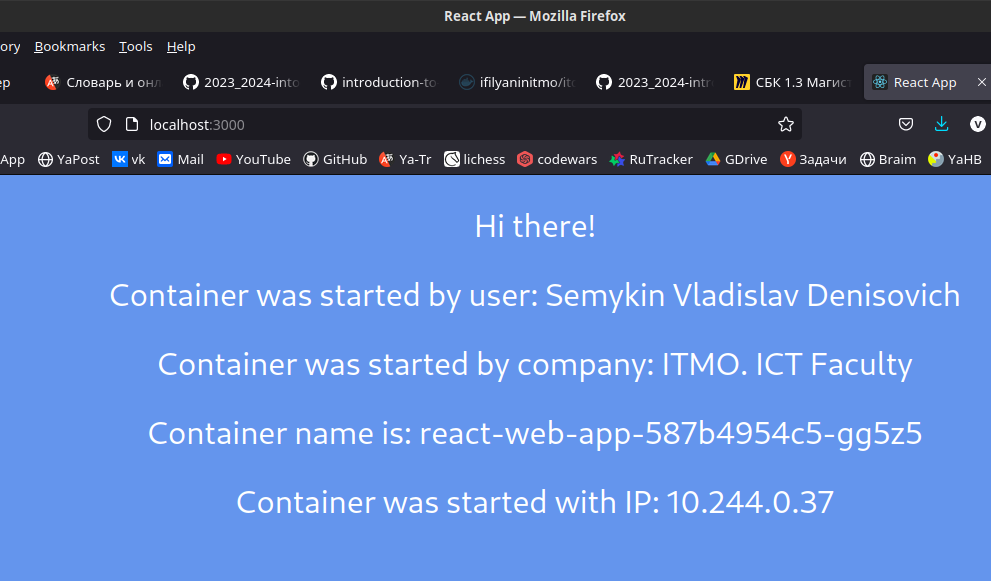
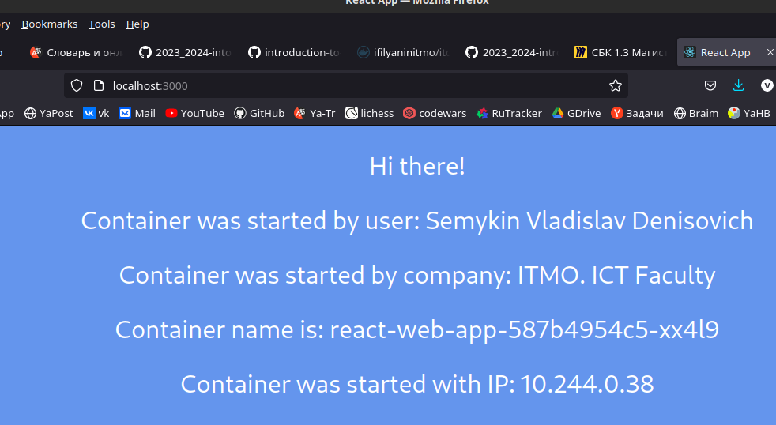
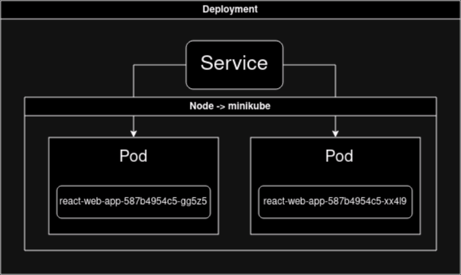

# Laboratory work #2

## Deployment of a web service in Minikube, access to the web interface of the service. Monitoring of the service

University: [ITMO University](https://itmo.ru/ru/)<p>
Faculty: [FICT](https://fict.itmo.ru)<p>
Course: [Introduction to distributed technologies](https://github.com/itmo-ict-faculty/introduction-to-distributed-technologies)<p>
Year: 2023/2024<p>
Group: K4110<p>
Author: Semykin Vladislav Denisovich<p>
Lab: Lab2<p>
Date of create: 18.10.2023<p>
Date of finished: XX.XX.2023<p>

## Description

In this lab, you will get acquainted with the deployment of a full-fledged web service with multiple replicas.

## Aim

Familiarize yourself with the types of container deployment "controllers", familiarize yourself with network services and deploy your web application.

## Tasks

- You need to create a deployment with 2 replicas of the <b>ifilyaninitmo/itdt-contained-frontend:master</b> container and pass variables to these replicas: <b>REACT_APP_USERNAME</b>, <b>REACT_APP_COMPANY_NAME</b>.
- Create a service through which you will have access to these "pods". The choice of the type of service is at your discretion.
- Launch port forwarding mode in minikube and connect to your containers via a web browser.
- Check the <b>REACT_APP_USERNAME</b>, <b>ROOT_APP_COMPANY_NAME</b> and Container name variables on the web browser page. Do they change? If so, why?
- Check the container logs, attach the logs to the report.

## Progress of a work

### Creating deployment

Firstly, we need to add container <b>ifilyaninitmo/itdt-contained-frontend:master</b> to our Docker with the following command:

```bash
sudo docker pull ifilyaninitmo/itdt-contained-frontend:master
```

> Do not forget to start docker service and sing in if it's necessary:
>
> ```bash
> sudo systemctl start docker
> sudo docker login
> ```

#### Output

```console
<loveit@fedora 2023_2024-intoduction_to_distributed_technologies-k4110-semykin-v-d>$ sudo docker pull ifilyaninitmo/itdt-contained-frontend:master
master: Pulling from ifilyaninitmo/itdt-contained-frontend
213ec9aee27d: Pull complete
7eb06cd79147: Pull complete
765a58e53190: Pull complete
beee7f5da459: Pull complete
ef9be46a2fcd: Pull complete
4f4fb700ef54: Pull complete
de687e97b091: Pull complete
c26a1b0cdf5b: Pull complete
76b9ce80a97c: Pull complete
Digest: sha256:08756f1022aea55538e740562aa980b56be6241d2166e6d8d6521386e0876dbe
Status: Downloaded newer image for ifilyaninitmo/itdt-contained-frontend:master
docker.io/ifilyaninitmo/itdt-contained-frontend:master
```

### Writing a manifest for deployment

Here is the manifest `react_manifest.yaml` that is deployment for supervise [container](https://hub.docker.com/r/ifilyaninitmo/itdt-contained-frontend) and creates 2 replica-sets of this container:

```yaml
apiVersion: apps/v1
kind: Deployment
metadata:
  name: react-web-app
  labels:
    app: react-web-app
spec:
  replicas: 2 # There we define count of replica-sets
  selector:
    matchLabels:
      app: react-web-app
  template:
    metadata:
      labels:
        app: react-web-app
    spec:
      containers:
        - name: react-web-app-container # Names of container(-s)
          image: ifilyaninitmo/itdt-contained-frontend
          env: # Here are environment variables
            - name: REACT_APP_USERNAME
              value: Semykin Vladislav Denisovich
            - name: REACT_APP_COMPANY_NAME
              value: ITMO. ICT Faculty
          resources:
          ports:
            - containerPort: 3000
```

To start the deployment we need to execute following command in the terminal:

```bash
kubectl apply -f react_manifest.yaml
```

And now we can see our created pods with the following command:

```bash
kubectl get pods
```

#### Output

```console
<loveit@fedora lab2>$ kubectl apply -f react_manifest.yaml
deployment.apps/react-web-app created
```

```console
<loveit@fedora lab2>$ kubectl get pods
NAME                             READY   STATUS             RESTARTS      AGE
react-web-app-676c567c99-5zp4j   0/1     ErrImagePull       0             3m39s
react-web-app-676c567c99-x2bdb   0/1     ImagePullBackOff   0             3m39s
vault                            1/1     Running            2 (27m ago)   8d
vault-6c7bb4db6c-k9bqn           1/1     Running            4 (27m ago)   9d
```

As we can see, my pod can't pull the image (STATUS = "ErrImagePull" & STATUS = "ImagePullBackOff"). To fix it, I used command to get more detailed information about the certain pod:

```bash
kubectl describe pod react-web-app-676c567c99-5zp4j
```

```console
<loveit@fedora lab2>$ kubectl describe pod react-web-app-676c567c99-5zp4j
Name:             react-web-app-676c567c99-5zp4j
Namespace:        default
Priority:         0
Service Account:  default
Node:             minikube/10.0.2.15
Start Time:       Fri, 20 Oct 2023 18:57:35 +0300
Labels:           app=react-web-app
                  pod-template-hash=676c567c99
Annotations:      <none>
Status:           Pending
IP:               10.244.0.36
IPs:
  IP:           10.244.0.36
Controlled By:  ReplicaSet/react-web-app-676c567c99
Containers:
  react-web-app-container:
    Container ID:
    Image:          ifilyaninitmo/itdt-contained-frontend
    Image ID:
    Port:           3000/TCP
    Host Port:      0/TCP
    State:          Waiting
      Reason:       ImagePullBackOff
    Ready:          False
    Restart Count:  0
    Environment:
      REACT_APP_USERNAME:      Semykin Vladislav Denisovich
      REACT_APP_COMPANY_NAME:  ITMO. ICT Faculty
    Mounts:
      /var/run/secrets/kubernetes.io/serviceaccount from kube-api-access-t7657 (ro)
Conditions:
  Type              Status
  Initialized       True
  Ready             False
  ContainersReady   False
  PodScheduled      True
Volumes:
  kube-api-access-t7657:
    Type:                    Projected (a volume that contains injected data from multiple sources)
    TokenExpirationSeconds:  3607
    ConfigMapName:           kube-root-ca.crt
    ConfigMapOptional:       <nil>
    DownwardAPI:             true
QoS Class:                   BestEffort
Node-Selectors:              <none>
Tolerations:                 node.kubernetes.io/not-ready:NoExecute op=Exists for 300s
                             node.kubernetes.io/unreachable:NoExecute op=Exists for 300s
Events:
  Type     Reason     Age                    From               Message
  ----     ------     ----                   ----               -------
  Normal   Scheduled  4m4s                   default-scheduler  Successfully assigned default/react-web-app-676c567c99-5zp4j to minikube
  Normal   Pulling    2m19s (x4 over 4m2s)   kubelet            Pulling image "ifilyaninitmo/itdt-contained-frontend"
  Warning  Failed     2m15s (x4 over 3m57s)  kubelet            Failed to pull image "ifilyaninitmo/itdt-contained-frontend": rpc error: code = Unknown desc = Error response from daemon: manifest for ifilyaninitmo/itdt-contained-frontend:latest not found: manifest unknown: manifest unknown
  Warning  Failed     2m15s (x4 over 3m57s)  kubelet            Error: ErrImagePull
  Warning  Failed     2m3s (x6 over 3m56s)   kubelet            Error: ImagePullBackOff
  Normal   BackOff    112s (x7 over 3m56s)   kubelet            Back-off pulling image "ifilyaninitmo/itdt-contained-frontend"
```

As we can see from this detailed information, I forgot the **":master"** after **"ifilyaninitmo/itdt-contained-frontend"**, thus, after add this in line:

```yaml
... rest of deployment yaml
    spec:
      containers:
        - name: react-web-app-container # Names of container(-s)
          image: ifilyaninitmo/itdt-contained-frontend:master
... remains
```

At first, I need to remove my pods:

> Following command need to be executed in the directory with file `react_manifest.yaml`

```bash
kubectl delete -f .
```

After this we need to create deployment again and check state of our replicas:

```bash
kubectl apply -f react_manifest.yaml
kubectl get pods
```

#### Output

```console
<loveit@fedora lab2>$ kubectl apply -f react_manifest.yaml
deployment.apps/react-web-app created
<loveit@fedora lab2>$ kubectl get pods
NAME                             READY   STATUS    RESTARTS      AGE
react-web-app-587b4954c5-gg5z5   1/1     Running   0             12m
react-web-app-587b4954c5-xx4l9   1/1     Running   0             12m
vault                            1/1     Running   2 (58m ago)   8d
vault-6c7bb4db6c-k9bqn           1/1     Running   4 (58m ago)   9d
```

Now our two replicas of **react-web-app** have "Running" state.

### Writing YAML for service

At this step we already have deployment with 2 replicas of one pod.
To check ran nodes execute following command:

```bash
kubectl get nodes
```

#### Output

```console
<loveit@fedora lab2>$ kubectl get nodes
NAME       STATUS   ROLES           AGE   VERSION
minikube   Ready    control-plane   44d   v1.26.8
```

For my case I can draw the next scheme of deployment:



Now we need to write another YAML file for service from that we can get access to these pods:

```yaml
apiVersion: v1
kind: Service
metadata:
  name: react-web-app
spec:
  selector:
    app: react-web-app
  ports:
    - port: 3000 # Host port. Lets do it the same - 3000
      targetPort: 3000 # Port of container (in 'react_manifest.yaml' we used 3000)
      protocol: TCP
```

Starting this service:

```bash
kubectl apply -f service.yaml
```

#### Output

```console
service/react-web-app created
```

To view services execute the following command:

```bash
kubectl get services
```

#### Output

```consolse
<loveit@fedora lab2>$ kubectl get services
NAME            TYPE        CLUSTER-IP      EXTERNAL-IP   PORT(S)          AGE
kubernetes      ClusterIP   10.96.0.1       <none>        443/TCP          44d
react-web-app   ClusterIP   10.106.24.123   <none>        3000/TCP         12s
vault           NodePort    10.101.21.93    <none>        8200:32575/TCP   9d
```

Now we need to connect service to port on local machine. For example, the following command connects the pod with ID **react-web-app-587b4954c5-gg5z5**:

```bash
kubectl port-forward react-web-app-587b4954c5-gg5z5 3000:3000
```

#### Output

```console
<loveit@fedora lab2>$ kubectl port-forward react-web-app-587b4954c5-gg5z5 3000:3000
Forwarding from 127.0.0.1:3000 -> 3000
Forwarding from [::1]:3000 -> 3000
Handling connection for 3000
Handling connection for 3000
```



Now, I interrupted (Ctrl + C) work of this `port-forward` utility to break out this pod to start 2nd pod:

```bash
kubectl port-forward react-web-app-587b4954c5-xx4l9 3000:3000
```

#### Output

```console
<loveit@fedora lab2>$ kubectl port-forward react-web-app-587b4954c5-xx4l9 3000:3000
Forwarding from 127.0.0.1:3000 -> 3000
Forwarding from [::1]:3000 -> 3000
Handling connection for 3000
Handling connection for 3000
```

Now we can noticed that **Container name is** changed. But ENV vars do not changed, because to change them we need to stop deployment (1), change yaml for deployment - `react-manifest.yaml` (2), run deployment (3), start service (4), move [to localhost with 3000 port](https://localhost:3000) to see changes (5).



### Getting logs

Following command help to get logs of our pods:

```bash
kubectl logs react-web-app-587b4954c5-xx4l9
kubectl logs react-web-app-587b4954c5-gg5z5
```

#### Output

##### PodID: react-web-app-587b4954c5-xx4l9

```console
Builing frontend
Browserslist: caniuse-lite is outdated. Please run:
  npx update-browserslist-db@latest
  Why you should do it regularly: https://github.com/browserslist/update-db#readme
Browserslist: caniuse-lite is outdated. Please run:
  npx update-browserslist-db@latest
build finished
  Why you should do it regularly: https://github.com/browserslist/update-db#readme
Server started on port 3000
```

##### PodID: react-web-app-587b4954c5-gg5z5

```console
Builing frontend
Browserslist: caniuse-lite is outdated. Please run:
  npx update-browserslist-db@latest
  Why you should do it regularly: https://github.com/browserslist/update-db#readme
Browserslist: caniuse-lite is outdated. Please run:
  npx update-browserslist-db@latest
  Why you should do it regularly: https://github.com/browserslist/update-db#readme
build finished
Server started on port 3000
```

### Scheme of service and pods organazation



> Do not forget to stop minikube
>
> ```bash
> minikube stop
> ```
>
> ```console
> ✋  Stopping node "minikube"  ...
> 🛑  1 node stopped.
> ```

### Conclusion

While doing this laboratory work I encountered with problem that the status of the pods are "ErrImagePull" and "ImagePullBackOff". Command `kubectl describe` help me to solve this issue. As a conclusion I drew scheme of deployment that controlls replica-sets which in turn controls our 2 pods. Also, drew the organazation scheme of services and pods. As a result, I wrote 2 manifests - first for deployment, second for service, then conducted some experiments with starting pods, results you can see on screenshots above.
