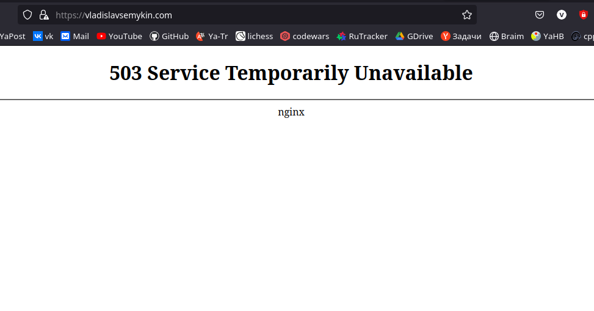
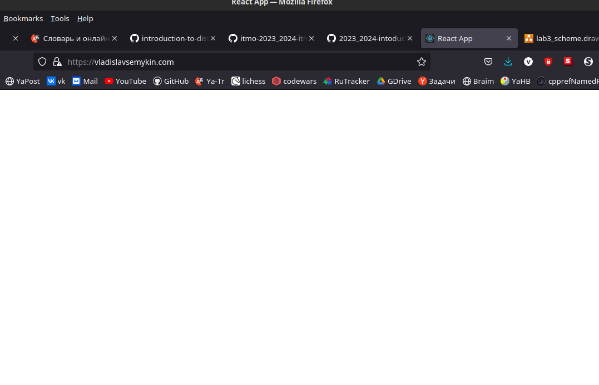
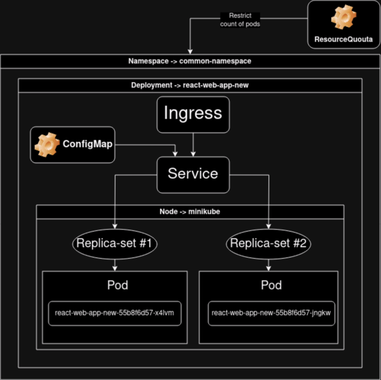

# Laboratory work #3

## Certificates and "secrets" in Minikube, secure data storage.

University: [ITMO University](https://itmo.ru/ru/)\
Faculty: [FICT](https://fict.itmo.ru)\
Course: [Introduction to distributed technologies](https://github.com/itmo-ict-faculty/introduction-to-distributed-technologies)\
Year: 2023/2024\
Group: K4110c\
Author: Semykin Vladislav Denisovich\
Lab: Lab2\
Date of create: 18.10.2023\
Date of finished: XX.XX.2023\

## Description

In this laboratory work, you will get acquainted with certificates and "secrets" in Minikube, the rules for safe data storage in Minikube.

## Aim

Get acquainted with certificates and "secrets" in Minikube, the rules of safe data storage in Minikube.

## Tasks

- You need to create a `ConfigMap` with the variables: `REACT_APP_USERNAME`, `REACT_APP_COMPANY_NAME'.

- You need to create a `ReplicaSet` with 2 replicas of the container [ifilyaninitmo/itdt-contained-frontend:master](https://hub.docker.com/repository/docker/ifilyaninitmo/itdt-contained-frontend) and using the previously created `ConfigMap` pass the variables `REACT_APP_USERNAME`, `REACT_APP_COMPANY_NAME'.

- Enable `minikube addons enable ingress` and generate a TLS certificate, import the certificate into minikube.

- Create an ingress in minikube, where the previously imported certificate is specified, the FQDN that you will use to log in and the name of the service that you created earlier.

> If you are doing this work on Windows/macOS to access ingress you need to use the `minikube tunnel` command to the created ingress.
> If you are doing this work on Windows/macOS to access ingress, you need to add the ip address and your FQDN to the hosts.

- In the `hosts`, enter the FQDN and IP address of your ingress and try to go to the browser by the FQDN name.

- Log in to the web application using your FQDN using HTTPS and check for the certificate.

> Usually in the browser it is a small lock next to the FQDN of the site, click on it and take a screenshot with the information.

## Progress of a work

### Writing the ConfigMap object

**ConfigMap** is the main object for storing configuration data in Kubernetes. It can be represented as a named set of key—value pairs in which the configuration is stored.

The mechanism for controlling resource consumption in a cluster is the use of **namespaces**. The namespace in Kubernetes provides a way to divide a cluster into separate parts. In this case, the namespace is used to combine all created resources (service and deployment, in which 2 replica-set objects are created to manage pods).

At first, we need to combine all the resources, to do this we need namespace:

```yaml
apiVersion: apps/v1
kind: Namespace
metadata:
  name: common-namespace
```

Now, we can write YAML for ConfigMap object, where we define 2 environment variables from the previous [laboratory work](https://github.com/ViNN280801/2023_2024-intoduction_to_distributed_technologies-k4110-semykin-v-d/blob/main/lab2/lab2_report.md).

```yaml
apiVersion: v1
kind: ConfigMap
metadata:
  name: config
  namespace: common-namespace
data:
  # There are pairs of key-value, that specified as "key: value"
  REACT_APP_USERNAME: "Semykin Vladislav Denisovich"
  REACT_APP_COMPANY_NAME: "ITMO. ICT Faculty"
```

YAMLs for deployment and service got from previous laboratory work, but from `react_manifest.yaml` removed these 2 environment variables which added in ConfigMap object.

For convenience we can combine all the manifests to one single manifest by using `---`, for example:

```yaml
# Step 1: Creating namespace to combine all necessary Kubernetes objects
apiVersion: apps/v1
kind: Namespace
metadata:
  name: common-namespace

# Step 2: Creating ConfigMap object with 2 ENV vars
---
apiVersion: v1
kind: ConfigMap
metadata:
  name: config
  namespace: common-namespace
data:
  # There are pairs of key-value, that specified as "key: value"
  REACT_APP_USERNAME: "Semykin Vladislav Denisovich"
  REACT_APP_COMPANY_NAME: "ITMO. ICT Faculty"
```

### ResourceQuota

**ResourceQuota** - constraints supply of the process time and memory not only for containers, and for namespaces. The _prefferable_ approach is to use **ResourceQuotas** to limimt count of pods, which can be executing in there. Let's write manifest for it:

```yaml
apiVersion: v1
kind: ResourceQuota
metadata:
  name: react-web-app
  namespace: common-namespace
spec:
  hard:
    pods: "2" # Here we define the limit on count of the pods
```

### Enabling Ingress resources

> **Ingress** is a kind of load balancer placed in front of the service. It transmits requests from clients to the service. The service, in turn, sends them to suitable pod shells based on the label selector.

**Services** are well suited for routing the internal traffic of your cluster (for example, from one microservice to another). **Ingress** objects, in turn, are designed to redirect external requests to your cluster and a suitable microservice. Ingress can direct traffic to different services based on the rules you set. The most common routing of requests is based on their URLs. Among other things, Ingress supports secure connections based on the TLS protocol (formerly known as SSL). If you have many different services and applications on the same domain, they can all have a common TLS certificate and a single Ingress resource can manage these connections.

To enable **Ingress** resources we need to execute the following command:

```bash
minikube addons enable ingress
```

#### Output

```console
💡  ingress is an addon maintained by Kubernetes. For any concerns contact minikube on GitHub.
You can view the list of minikube maintainers at: https://github.com/kubernetes/minikube/blob/master/OWNERS
    ▪ Using image registry.k8s.io/ingress-nginx/kube-webhook-certgen:v20230407
    ▪ Using image registry.k8s.io/ingress-nginx/kube-webhook-certgen:v20230407
    ▪ Using image registry.k8s.io/ingress-nginx/controller:v1.8.1
🔎  Verifying ingress addon...
🌟  The 'ingress' addon is enabled
```

### Generating a TLS certificate

Self-signed TLS certificates are suitable for personal use or for applications that are used internally within an organization.\
To generate TLC certificate with my signature, I used [this resourse](https://www.linode.com/docs/guides/create-a-self-signed-tls-certificate/), that describes this process in all details.

**Generate the Certificate**:

```bash
openssl req -new -newkey rsa:4096 -x509 -sha256 -days 363 -nodes -out mycertificate363.crt -keyout mykey.key
```

- `newkey rsa:4096`: Create a 4096 bit RSA key for use with the certificate. RSA 2048 is the default on more recent versions of OpenSSL but to be sure of the key size, you should specify it during creation.
- `x509`: Create a self-signed certificate.
- `sha256`: Generate the certificate request using 265-bit SHA (Secure Hash Algorithm).\
- `days`: Determines the length of time in days that the certificate is being issued for. For a self-signed certificate, this value can be increased as necessary.\
- `nodes`: Create a certificate that does not require a passphrase. If this option is excluded, you will be required to enter the passphrase in the console each time the application using it is restarted.

#### Output

```console
......+++++++++++++++++++++++++++++++++++++++++++++++++++++++++++++++++*.....+.......+......+.....+.+...+...+.....+...+................+......+..+.......+..............+......+.+........+......+..........+...+......+............+..+.+..+.......+..+...+.+..............+.+...........+...+......+............+...+....+......+..............+...+...+.......+...+..+...+......+.+..............+....+.....+++++++++++++++++++++++++++++++++++++++++++++++++++++++++++++++++*...............+.....................+......+..+.......+...........+...+....+...+...+......+.....+......+...+............+..................+.........+...........................+................+..+.+......+...+.....+......+.+..................+++++++++++++++++++++++++++++++++++++++++++++++++++++++++++++++++
.......+...+..+++++++++++++++++++++++++++++++++++++++++++++++++++++++++++++++++*.+......+.+...............+.....+...+++++++++++++++++++++++++++++++++++++++++++++++++++++++++++++++++*.......+...+....+........+...........................+...+............+.......+.........+..+...+..........+...........+......+............+......+.+......+..+.......+.....+....+.........+...........+......+.............+.................+...+......+.+...+...+...+..+....+......+..+..................+....+...+..+.+.....+.......+......+.........+..+..........+...............+.........+..+............+......+.........+...+..........+.........+......+.....+.........+........................+..........+.....+....+...+..+..................+.........................+.....+.......+............+........+.+......+...+...+............+.....+......+.+........+......................+.....+.+.....+...+....+.................+....+......+...............+...+..+....+.................+.......+..+.+.....+...+...............+...................+...........+.....................+....+.....+................+......+.....+....+......+...+..+.........+..................+.+.........+...+.....+...+.+..............+.+.........+......+...........+.......+...+.....+.........+....+.........+......+......+....................+................+...+......+........+...+.............+............+..+..........+......+..+...+.+........+.......+.........+......+........+...+..........+........+.+...+..+.........+.........+...............+.....................+....+...+..+.+.....+............+............+......+.+...+..+....+..+.......+...............+.....+...+..................+......+...+................+.........+..+.+....................+..........+.........+...........+.......+...+.....+..........+...+......+......+.....+.......+...+.....+.........+.........+.......+.................................+..+....+...+..+....+......+.....+.........+............+.......+...+..............+.+..+...+.........+......+............................+...........+.+..+.+............+..+.......+.....+.........+....+..+......+....+.....+......+...+.......+.....+...+.....................+.+..+.......+...+...........+....+...+............+...............+.....+.+..+...+.+......+.................+.+.................+..................+.+......+........+....+......+...........................+...............+..+.+.....+......+.............+.....+............+......+.......+...+.........+........+......+....+........+....+...+..+.+........+.......+.....+....+...+..+..........+.....+......+...+......+++++++++++++++++++++++++++++++++++++++++++++++++++++++++++++++++
-----
You are about to be asked to enter information that will be incorporated
into your certificate request.
What you are about to enter is what is called a Distinguished Name or a DN.
There are quite a few fields but you can leave some blank
For some fields there will be a default value,
If you enter '.', the field will be left blank.
-----
Country Name (2 letter code) [XX]:Ru
State or Province Name (full name) []:SpB
Locality Name (eg, city) [Default City]:Saint-Petersburg
Organization Name (eg, company) [Default Company Ltd]:ITMO
Organizational Unit Name (eg, section) []:ICT
Common Name (eg, your name or your server's hostname) []:vladislavsemykin
Email Address []:mymail@mail.ru
```

This command creates a self-signed certificate (mycertificate363.crt) that is valid for 363 days.

**Impelementation certificate in minikube**

Creating the Kubernetes object - **Secret** with type **tls**. This specific type of Secret is commonly used for storing TLS (Transport Layer Security) certificates, which are used for securing network communication within a Kubernetes cluster.

But at first, we need to create the Namespace:

```bash
kubectl apply -f create_nmspace.yaml
```

#### Output

```console
namespace/common-namespace created
```

```bash
kubectl create secret tls -n common-namespace vladislavsemykin.com-tls --key=mykey.key --cert=mycertificate363.crt
```

`vladislavsemykin-tls`: Name that is giving to the Secret object.
`--key=mykey.key`: Flag that specifies the private key file that is part of your TLS certificate.
`--cert=mycertificate363.crt`: This flag specifies the TLS certificate file. The mycertificate363.crt file contains the public certificate that corresponds to the private key.
`-n`: Specifies the namespace

#### Output

```console
secret/vladislavsemykin-tls created
```

### Creating an Ingress object as manifest

```yaml
apiVersion: networking.k8s.io/v1
kind: Ingress
metadata:
  name: react-web-app
  namespace: common-namespace
  annotations:
    nginx.ingress.kubernetes.io/backend-protocol: HTTP
    nginx.ingress.kubernetes.io/rewrite-target: /
    nginx.ingress.kubernetes.io/ssl-redirect: "true"
  labels:
    name: react-web-app
spec:
  rules:
    - host: vladislavsemykin # Domain hostname
      http:
        paths:
          - pathType: Prefix
            path: /
            backend:
              service:
                name: react-web-app
                port:
                  number: 3000
  tls:
    - hosts:
        - vladislavsemykin # Domain hostname
      secretName: vladislavsemykin-tls
```

Applying manifest `start_web_app.yaml` with the command:

```bash
kubectl apply -f start_web_app.yaml
```

#### Output

```console
configmap/config created
resourcequota/react-web-app created
deployment.apps/react-web-app-new created
service/react-web-app created
ingress.networking.k8s.io/react-web-app created
```

Also, you can delete all these resources from `common-namespace` with the following command:

```bash
kubectl delete all --all -n common-namespace &&\
kubectl delete configmap --all -n common-namespace &&\
kubectl delete secret --all -n common-namespace &&\
kubectl delete ingress --all -n common-namespace &&\
kubectl delete namespaces common-namespace
```

Command to view all resources with namespace `common-namespace`:

```bash
kubectl get all -n common-namespace &&\
kubectl get configmaps -n common-namespace &&\
kubectl get secrets -n common-namespace &&\
kubectl get ingress -n common-namespace &&\
kubectl get namespaces
```

#### Output

```console
NAME                                     READY   STATUS    RESTARTS   AGE
pod/react-web-app-new-7756b768fc-ktgh7   1/1     Running   0          3m19s
pod/react-web-app-new-7756b768fc-pb2wj   1/1     Running   0          3m20s

NAME                    TYPE        CLUSTER-IP      EXTERNAL-IP   PORT(S)    AGE
service/react-web-app   ClusterIP   10.109.92.185   <none>        3000/TCP   3m20s

NAME                                READY   UP-TO-DATE   AVAILABLE   AGE
deployment.apps/react-web-app-new   2/2     2            2           3m20s

NAME                                           DESIRED   CURRENT   READY   AGE
replicaset.apps/react-web-app-new-7756b768fc   2         2         2       3m21s
NAME               DATA   AGE
config             2      3m21s
kube-root-ca.crt   1      3m39s
NAME                       TYPE                DATA   AGE
vladislavsemykin.com-tls   kubernetes.io/tls   2      3m28s
NAME            CLASS   HOSTS                  ADDRESS     PORTS     AGE
react-web-app   nginx   vladislavsemykin.com   10.0.2.15   80, 443   3m20s
NAME               STATUS   AGE
common-namespace   Active   3m39s
default            Active   135m
ingress-nginx      Active   135m
kube-node-lease    Active   135m
kube-public        Active   135m
kube-system        Active   135m
```

### Occured issue and resolving it

> Exiting due to MK_UNIMPLEMENTED: minikube tunnel is not currently implemented with the builtin network on QEMU

On this step I can't get access on the website, so, the problem is solved. My **minikube** always started with [qemu](https://minikube.sigs.k8s.io/docs/drivers). I changed it to [**docker** driver](https://minikube.sigs.k8s.io/docs/drivers/docker):

```bash
minikube delete &&\
minikube start --driver=docker
```

#### Output

```console
😄  minikube v1.31.2 on Fedora 38
✨  Using the docker driver based on user configuration
📌  Using Docker driver with root privileges
👍  Starting control plane node minikube in cluster minikube
🚜  Pulling base image ...
    > index.docker.io/kicbase/sta...:  447.62 MiB / 447.62 MiB  100.00% 697.89
❗  minikube was unable to download gcr.io/k8s-minikube/kicbase:v0.0.40, but successfully downloaded docker.io/kicbase/stable:v0.0.40 as a fallback image
🔥  Creating docker container (CPUs=2, Memory=2200MB) ...
🐳  Preparing Kubernetes v1.27.4 on Docker 24.0.4 ...
    ▪ Generating certificates and keys ...
    ▪ Booting up control plane ...
    ▪ Configuring RBAC rules ...
🔗  Configuring bridge CNI (Container Networking Interface) ...
    ▪ Using image gcr.io/k8s-minikube/storage-provisioner:v5
🔎  Verifying Kubernetes components...
🌟  Enabled addons: default-storageclass, storage-provisioner
🏄  Done! kubectl is now configured to use "minikube" cluster and "default" namespace by default
```

Now we need to apply all the manifests again:

```bash
minikube addons enable ingress &&\
kubectl apply -f create_nmspace.yaml &&\
kubectl create secret tls -n common-namespace vladislavsemykin.com-tls --key=mykey.key --cert=mycertificate363.crt &&\
kubectl apply -f start_web_app.yaml
```

Viewing all resources:

#### Output

```console
NAME                                    READY   STATUS    RESTARTS   AGE
pod/react-web-app-new-55b8f6d57-jngkw   1/1     Running   0          95s
pod/react-web-app-new-55b8f6d57-x4lvm   1/1     Running   0          95s

NAME                    TYPE        CLUSTER-IP      EXTERNAL-IP   PORT(S)    AGE
service/react-web-app   ClusterIP   10.110.13.210   <none>        3000/TCP   95s

NAME                                READY   UP-TO-DATE   AVAILABLE   AGE
deployment.apps/react-web-app-new   2/2     2            2           95s

NAME                                          DESIRED   CURRENT   READY   AGE
replicaset.apps/react-web-app-new-55b8f6d57   2         2         2       95s
NAME               DATA   AGE
config             2      95s
kube-root-ca.crt   1      96s
NAME                       TYPE                DATA   AGE
vladislavsemykin.com-tls   kubernetes.io/tls   2      96s
NAME            CLASS   HOSTS                  ADDRESS   PORTS     AGE
react-web-app   nginx   vladislavsemykin.com             80, 443   21s
NAME               STATUS   AGE
common-namespace   Active   96s
default            Active   31m
ingress-nginx      Active   7m47s
kube-node-lease    Active   31m
kube-public        Active   31m
kube-system        Active   31m
```

Let's view the IP address of the minikube node:

```bash
minikube ip
```

#### Output

```console
192.168.49.2
```

We need to include this address to the `/etc/hosts` file:

```bash
sudo vim /etc/hosts
```

Content of file `/etc/hosts`:

```sh
# Loopback entries; do not change.
# For historical reasons, localhost precedes localhost.localdomain:
127.0.0.1   localhost localhost.localdomain localhost4 localhost4.localdomain4
::1         localhost localhost.localdomain localhost6 localhost6.localdomain6
192.168.49.2   vladislavsemykin.com
# See hosts(5) for proper format and other examples:
# 192.168.1.10 foo.mydomain.org foo
# 192.168.1.13 bar.mydomain.org bar
```

> To rewrite it use: `:wq`

At this step we need to start tunneling:

```bash
minikube tunnel
```

#### Output

```console
Status:
	machine: minikube
	pid: 42876
	route: 10.96.0.0/12 -> 192.168.49.2
	minikube: Running
	services: []
    errors:
		minikube: no errors
		router: no errors
		loadbalancer emulator: no errors
```

Now I am encounter with 503 error:



To solve this, I added labels to service:

```yaml
selector:
  app: react-web-app
```

Updated main manifest:

```yaml
apiVersion: v1
kind: Service
metadata:
  name: react-web-app
  namespace: common-namespace
spec:
  type: ClusterIP
  ports:
    - port: 3000 # Host port. Lets do it the same - 3000
      targetPort: 3000 # Port of container (in 'react_manifest.yaml' we used 3000)
      protocol: TCP
  selector:
    app: react-web-app
```

Now, it's all ok, but there is the problem with the **cors** (issue within a react web application), that I can't fix.



### Checking the certificate

Following command will show all the information about `mycertificate363.crt`:

```bash
openssl x509 -in mycertificate363.crt -text -noout
```

#### Output

```console
Certificate:
    Data:
        Version: 3 (0x2)
        Serial Number:
            3d:bb:d0:b5:e3:0d:ea:f8:49:9e:a3:0b:0f:2c:b4:df:5d:ef:dc:ea
        Signature Algorithm: sha256WithRSAEncryption
        Issuer: C = Ru, ST = SpB, L = Saint-Petersburg, O = ITMO, OU = ICT, CN = vladislavsemykin, emailAddress = mymail@mail.ru
        Validity
            Not Before: Oct 23 16:48:28 2023 GMT
            Not After : Oct 20 16:48:28 2024 GMT
        Subject: C = Ru, ST = SpB, L = Saint-Petersburg, O = ITMO, OU = ICT, CN = vladislavsemykin, emailAddress = mymail@mail.ru
        Subject Public Key Info:
            Public Key Algorithm: rsaEncryption
                Public-Key: (4096 bit)
                Modulus:
                    00:c1:da:67:e7:32:a3:a9:6a:36:fb:9a:25:80:4b:
                    66:75:55:e0:c6:5f:97:c1:7c:9e:5e:0f:ba:93:9f:
                    ba:5f:6f:b7:dd:21:a6:f2:20:80:0e:9c:93:d6:00:
                    20:fd:1e:ac:38:26:9b:19:02:9e:4a:89:38:2c:cc:
                    da:d2:e4:ef:e3:ba:ad:c1:58:5c:8b:80:ac:80:44:
                    33:43:95:d2:f7:1b:d1:be:a7:20:2c:1e:be:2c:3b:
                    c2:0c:68:de:22:9f:9a:77:7d:89:91:43:68:d9:70:
                    ee:04:dc:3b:cd:7f:7f:5f:d9:c9:57:9f:62:03:04:
                    71:e4:4e:04:8c:3b:0c:7f:34:30:8b:e9:b5:1f:4d:
                    f0:be:1c:bf:38:49:48:e8:92:8c:5f:01:1f:14:11:
                    ff:e0:2e:cd:98:3a:39:16:eb:df:07:d4:36:a9:8e:
                    c3:3a:8f:13:4e:0a:13:4c:1d:34:ae:40:98:06:43:
                    de:fd:ec:f9:4f:ee:38:68:df:24:0d:7d:be:55:88:
                    50:47:a5:db:de:85:2e:c4:4e:e8:9b:93:65:12:4f:
                    b7:6c:29:ff:2a:a2:03:bc:68:54:ea:33:86:07:e6:
                    e5:a5:62:ec:16:53:03:68:7a:5f:5e:93:e1:37:47:
                    3e:40:bf:07:4c:d1:f5:b2:5a:6b:97:35:21:56:af:
                    64:e0:01:98:95:10:fd:32:a2:30:62:f7:7a:27:01:
                    4d:26:f7:ba:2a:5b:3f:db:31:79:6f:32:75:c6:51:
                    20:46:b8:7a:d6:95:50:3d:8f:dd:0d:4d:c7:c1:9f:
                    f3:89:44:97:02:e9:4c:6d:36:d5:c8:cb:73:16:31:
                    58:5a:00:17:1c:73:0f:b3:7b:69:fb:59:29:ec:ff:
                    33:64:4e:23:a7:88:2d:5e:1a:a4:11:b0:1d:10:72:
                    7a:ca:b2:e3:ea:ba:73:4c:19:30:35:1c:8f:a3:06:
                    13:10:1b:65:fd:74:03:de:e1:20:46:df:b4:d4:0f:
                    07:9e:23:d7:fb:87:15:54:73:bc:80:13:3d:df:47:
                    ee:c3:29:df:c7:24:3f:75:1b:28:3c:fb:21:d6:24:
                    52:44:29:86:06:e2:f6:a7:87:80:3c:e3:b7:93:81:
                    1a:51:52:35:4d:f1:9b:47:7d:47:34:85:b6:f9:f9:
                    42:01:c1:40:21:ea:99:10:f4:38:9b:fb:88:a1:af:
                    88:06:f8:be:49:25:6d:b2:f6:2a:6a:b2:12:6a:a9:
                    cc:20:85:47:0d:1b:e2:0c:98:59:d9:50:e2:40:1b:
                    6b:a2:7d:fe:14:ed:73:e9:20:66:d9:70:87:37:71:
                    9a:b9:07:7e:cc:f1:b4:6a:51:e1:3a:58:00:3c:13:
                    9e:0c:9f
                Exponent: 65537 (0x10001)
        X509v3 extensions:
            X509v3 Subject Key Identifier:
                BD:EA:52:8A:CD:CE:7E:AC:42:E5:0E:E7:A0:43:91:F6:F4:14:D6:54
            X509v3 Authority Key Identifier:
                BD:EA:52:8A:CD:CE:7E:AC:42:E5:0E:E7:A0:43:91:F6:F4:14:D6:54
            X509v3 Basic Constraints: critical
                CA:TRUE
    Signature Algorithm: sha256WithRSAEncryption
    Signature Value:
        17:32:b2:50:14:ba:64:14:ee:b0:f5:ea:9a:39:aa:94:69:36:
        11:91:ca:c6:a8:5f:fe:2c:33:f0:64:2a:70:91:d4:45:db:97:
        df:ee:77:96:e9:b7:b3:30:41:c9:96:89:d5:7e:e4:3d:77:bd:
        0a:9a:5c:d0:6d:d9:2e:e1:ce:9d:30:01:e2:1c:04:fd:87:4d:
        09:09:8b:d1:44:d6:44:86:1c:2d:b1:d9:95:fb:1e:47:05:4c:
        28:18:7f:a2:7f:20:14:87:05:3f:7d:b8:aa:7e:f8:6f:ee:38:
        10:08:51:46:8d:a0:6c:d3:b8:47:5c:b6:1e:13:dd:21:d1:f6:
        74:f6:1b:a9:bf:d9:c5:a0:70:7b:46:a2:5c:bb:6a:8e:0e:68:
        36:a3:2d:bd:3f:21:55:cd:c7:55:95:d2:d7:c0:10:8b:11:a5:
        23:ec:30:d9:cc:a7:55:e2:ce:db:72:76:56:28:8f:c0:10:af:
        79:d5:37:b0:5f:ba:73:05:c0:de:e9:5a:e8:52:da:4d:93:8e:
        bc:4e:7c:a3:48:f2:60:48:b6:ec:bf:fa:6d:79:6d:51:96:a0:
        f2:bc:0f:b5:f8:64:14:f9:5a:06:dd:d3:36:e0:cf:98:c7:cf:
        14:83:9e:c1:b6:57:c5:40:9e:d6:80:bd:79:dd:87:ee:3a:cc:
        8e:3b:33:21:fd:19:0d:10:c1:dc:2b:73:d3:14:43:2b:3e:6d:
        62:ac:26:ae:59:e2:6e:18:93:d3:ff:bf:56:9f:79:bb:0e:83:
        2d:24:b7:c9:6c:97:dc:a9:7b:65:a1:51:3a:7d:72:0a:03:bb:
        e3:07:af:9b:0d:a2:18:06:ea:24:08:56:2e:45:21:a9:f0:db:
        dd:eb:52:66:37:18:24:39:ea:e5:db:67:7c:5c:7e:22:03:a5:
        75:22:5f:97:cb:0c:45:61:00:68:39:95:40:76:2a:b2:2d:d0:
        64:06:4f:d0:8f:53:3b:8e:5b:45:92:4a:2a:7d:99:ff:1d:7a:
        2f:82:a5:0d:15:d7:b7:3b:1e:10:da:1f:f6:33:86:27:c5:ab:
        88:dc:d8:f3:fc:c3:70:df:b1:a9:cb:b6:87:07:dd:e8:02:cb:
        40:86:dd:7f:d4:14:ad:02:9d:19:7e:32:b7:25:b1:2f:b4:db:
        65:1c:1e:1c:aa:5f:9f:1f:9e:d4:c4:6e:b1:41:b7:57:58:b0:
        76:ba:37:cf:d6:d5:0d:9d:ee:f5:95:da:8f:45:56:22:11:da:
        6d:75:29:d8:d9:07:06:f0:d2:1e:4c:c3:1d:0d:79:9a:03:ce:
        e8:7f:e8:8e:01:f6:cd:32:4b:3c:cc:2a:ab:48:0d:c6:a2:7d:
        98:7c:a8:de:ac:0c:aa:df
```

### Organazation scheme



## Conclusion

I got acquainted with certificates and "secrets" in Minikube, the rules of safe data storage in Minikube. For do this, I used the deployment and service manifests from the [previous laboratory work](https://github.com/ViNN280801/2023_2024-intoduction_to_distributed_technologies-k4110-semykin-v-d/blob/main/lab2/lab2_report.md) and slightly changed them. In addition, I wrote manifests for some Kubernetes resources, which are: ResourceQuota (prefferable approach to limit count of replica-sets in the deployment), Secret (which I created by a command using `kubectl` utility with pregenerated key using `openssl`) and Ingress (to maintain the load of the services - passes user's requests, in turn service passes them to the appropriate pods based on `selector` labes).
Organazation scheme, that you can see on **Organazation scheme** section above has been drew.
In summary, I encountered with some issues while I do this laboratory work. Their solution presented in a progress of work.

**Issues & Solutions**:

1. Firstly we need to create namespace. Before we try to create the secret.
2. Initially my `minikube` node started with driver `qemu`, which doesn't allow to tunneling, which means, that command: `minikube tunnel` was accompained by en error. To solve this issue I deleted old minikube node with qemu driver and install new minikube node with `docker` driver: `minikube start --driver=docker`.
3. Unfortunately, last problem with **cors** is not on my controll. The problem with "CORS" stands for Cross-Origin Resource Sharing. It's a security feature implemented by web browsers to prevent web pages from making requests to a different domain (i.e., a different origin) than the one that served the web page. When CORS is not properly configured, it can lead to issues when one web application hosted on one domain tries to make requests to a different domain's resources, like APIs or data. Because I tried to build the react **web** application, I encountered with this problem when trying to access this data.
