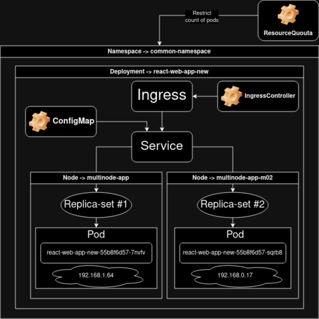

# Laboratory work #4

## Communication networks in Minikube, CNI and CoreDNS

University: [ITMO University](https://itmo.ru/ru/)\
Faculty: [FICT](https://fict.itmo.ru)\
Course: [Introduction to distributed technologies](https://github.com/itmo-ict-faculty/introduction-to-distributed-technologies)\
Year: 2023/2024\
Group: K4110c\
Author: Semykin Vladislav Denisovich\
Lab: Lab4\
Date of create: 27.10.2023\
Date of finished: XX.XX.2023

## Description

This is the last laboratory work in which you will get acquainted with communication networks in Minikube. The peculiarity of Kubernetes is that it simultaneously has `underlay` and `overlay` networks, and management can be organized by various CNIs.

## Aim

To get acquainted with CNI Calico and the `IPAS Plugin` function, to study the features of CNI and Core DNS.

## Tasks

- When starting minikube, install the `CNI=calico` plugin and the `Multi-Node Clusters` operation mode at the same time, as part of this laboratory work, you need to deploy 2 nodes.

> Original instructions for installing Calico in Minikube [link](https://projectcalico.docs.tigera.io/getting-started/kubernetes/minikube)
> Original instructions for enabling 2 nodes in Minikube [link](https://minikube.sigs.k8s.io/docs/tutorials/multi_node /)

- Check the work of the CNI Calico plugin and the number of nodes, attach the results of the check to the report.

- To test the work of Calico, we will try one of the functions called `IPAM Plugin'.

- To check the `IPAM` mode, it is necessary to specify the `label` for previously launched nodes based on the rack or geographical location (of your choice).

> [Original instructions for assigning IP addresses in Calico](https://projectcalico.docs.tigera.io/networking/assign-ip-addresses-topology)

- After that, you need to develop a manifest for Calico that, based on the previously specified labels, would assign IP addresses to "submit" based on the pools of IP addresses that you specified in the manifest.

- You need to create a `deployment` with 2 replicas of the container [ifilyaninitmo/itdt-contained-frontend:master](https://hub.docker.com/repository/docker/ifilyaninitmo/itdt-contained-frontend) and pass variables to these replicas: `REACT_APP_USERNAME`, `REACT_APP_COMPANY_NAME'.

- Create a service through which you will have access to these "pods". The choice of the type of service is at your discretion.

- Launch port forwarding mode in `minikube` and connect to your containers via a web browser.

- Check the variables `Container name` and `Container IP` on the page in the web browser. Do they change? If so, why?

- Using `kubectl exec`, go to any "pod" and try to ping the "pod" using the `FQDN` name of the neighboring "pod", the results of the pings must be attached to the report.

## Progress of a work

### Starting 2 nodes of `minikube` with the `Calico` plugin

> Do not forget to start the `docker` service and login
>
> ```bash
> sudo systemctl start docker
> sudo docker login
> ```

```bash
minikube start --driver=docker --nodes 2 -p multinode-app --network-plugin=cni --cni=calico
```

```
<loveit@fedora ~>$ minikube start --driver=docker --nodes=2 --network-plugin=cni --cni=calico
😄  [multinode-app] minikube v1.31.2 on Fedora 38
✨  Using the docker driver based on user configuration
❗  With --network-plugin=cni, you will need to provide your own CNI. See --cni flag as a user-friendly alternative
📌  Using Docker driver with root privileges
👍  Starting control plane node multinode-app in cluster multinode-app
🚜  Pulling base image ...
❗  minikube was unable to download gcr.io/k8s-minikube/kicbase:v0.0.40, but successfully downloaded docker.io/kicbase/stable:v0.0.40 as a fallback image
🔥  Creating docker container (CPUs=2, Memory=2200MB) ...
🐳  Preparing Kubernetes v1.27.4 on Docker 24.0.4 ...
    ▪ Generating certificates and keys ...
    ▪ Booting up control plane ...
    ▪ Configuring RBAC rules ...
🔗  Configuring Calico (Container Networking Interface) ...
    ▪ Using image gcr.io/k8s-minikube/storage-provisioner:v5
🔎  Verifying Kubernetes components...
🌟  Enabled addons: default-storageclass, storage-provisioner

👍  Starting worker node multinode-app-m02 in cluster multinode-app
🚜  Pulling base image ...
🔥  Creating docker container (CPUs=2, Memory=2200MB) ...
🌐  Found network options:
    ▪ NO_PROXY=192.168.58.2
❗  This container is having trouble accessing https://registry.k8s.io
💡  To pull new external images, you may need to configure a proxy: https://minikube.sigs.k8s.io/docs/reference/networking/proxy/
🐳  Preparing Kubernetes v1.27.4 on Docker 24.0.4 ...
    ▪ env NO_PROXY=192.168.58.2
🔎  Verifying Kubernetes components...
🏄  Done! kubectl is now configured to use "multinode-app" cluster and "default" namespace by default
```

Let's check our created nodes and pods:

```bash
kubectl get nodes && kubectl get pods --selector k8s-app=calico-node
```

```
NAME                STATUS   ROLES    AGE   VERSION
multinode-app       Ready    <none>   53s   v1.27.4
multinode-app-m02   Ready    <none>   29s   v1.27.4
NAMESPACE     NAME                READY   STATUS    RESTARTS      AGE
kube-system   calico-node-8h2vt   1/1     Running   1 (91s ago)   15m
kube-system   calico-node-rttmf   1/1     Running   1 (39s ago)   14m
```

Here we can see 2 nodes and 2 pods from the output of previous commands. Let notice, that the **each pod started on each node**.

### IPAM Plugin

Firstly, we need to add labels to our minikube nodes, I'll do it with [`kube-shell`]() and `kubectl edit` command:

```bash
kubectl edit node multinode-app
kubectl edit node multinode-app-m02
```

Command `kubectl edit` would open your default text editor with the manifest of specified Kubernetes resource. If smth goes wrong (you made a mistakes or smth else), kubectl reports about it and opens the certain manifest for make a corrections, otherwise `kubectl` updates resource like command `kubectl apply -f <manifest_name.yaml>`.


Let check our labels:

```bash
kubectl get nodes -l nodeName=fstNode
kubectl get nodes -l nodeName=sndName
```

> Yes, I did their names intentionally.


Now, we need to delete default IP pool and create 2 different IP pools for each node. [Instructions there](https://docs.tigera.io/calico/latest/networking/ipam/assign-ip-addresses-topology).

```bash
kubectl get ippool
```

```
NAME                  AGE
default-ipv4-ippool   31m
```

```yaml
apiVersion: projectcalico.org/v3
kind: IPPool
metadata:
  name: multinode-app
spec:
  cidr: 192.168.0.0/24
  ipipMode: Always
  natOutgoing: true
  nodeSelector: nodeName == "fstNode"

---
apiVersion: projectcalico.org/v3
kind: IPPool
metadata:
  name: multinode-app-m02
spec:
  cidr: 192.168.1.0/24
  ipipMode: Always
  natOutgoing: true
  nodeSelector: nodeName == "sndName"
```

Deletion of the default IP pool and applying manifest to create 2 custom IP pools:

> How to install [`calicoctl`](https://docs.tigera.io/calico/latest/operations/calicoctl/install#install-calicoctl-as-a-binary-on-a-single-host)
>
> ```bash
> curl -L https://github.com/projectcalico/calico/releases/download/v3.26.3/calicoctl-linux-amd64 -o kubectl-calico
> chmod +x ./calicoctl
> mv calicoctl <YOUR_PATH_ENV_VAR>
> ```
>
> To view your PATH variable values you can just do this:
>
> ```bash
> $PATH
> ```

````

```bash
kubectl delete ippool default-ipv4-ippool && calicoctl apply -f create_ippools.yaml --allow-version-mismatch
````

```
ippool.crd.projectcalico.org "default-ipv4-ippool" deleted
Successfully applied 2 'IPPool' resource(s)
```

```bash
calicoctl get ippool --allow-version-mismatch
```

```
NAME                CIDR             SELECTOR
multinode-app       192.168.0.0/24   nodeName == "fstNode"
multinode-app-m02   192.168.1.0/24   nodeName == "sndName"
```

### Starting web-service

We can get the manifest `start_web_app.yaml` from the [previous laboratory work](https://github.com/ViNN280801/2023_2024-intoduction_to_distributed_technologies-k4110-semykin-v-d/blob/main/lab3/lab3_report.md), but we need to add creating namespace to this manifest.

Let's apply this manifest:

```bash
kubectl apply -f start_web_app.yaml
```

```
namespace/common-namespace created
configmap/config created
resourcequota/react-web-app created
deployment.apps/react-web-app-new created
service/react-web-app created
ingress.networking.k8s.io/react-web-app created
```

Let's check all the created resources:

```bash
kubectl get namespaces &&\
kubectl get all -n common-namespace &&\
kubectl get configmaps -n common-namespace &&\
kubectl get ingress -n common-namespace
```

```
NAME               STATUS   AGE
common-namespace   Active   84s
default            Active   20h
kube-node-lease    Active   20h
kube-public        Active   20h
kube-system        Active   20h
NAME                                    READY   STATUS    RESTARTS   AGE
pod/react-web-app-new-55b8f6d57-ss8kb   1/1     Running   0          84s
pod/react-web-app-new-55b8f6d57-txpb7   1/1     Running   0          84s

NAME                    TYPE        CLUSTER-IP     EXTERNAL-IP   PORT(S)    AGE
service/react-web-app   ClusterIP   10.111.54.92   <none>        3000/TCP   84s

NAME                                READY   UP-TO-DATE   AVAILABLE   AGE
deployment.apps/react-web-app-new   2/2     2            2           84s

NAME                                          DESIRED   CURRENT   READY   AGE
replicaset.apps/react-web-app-new-55b8f6d57   2         2         2       84s
NAME               DATA   AGE
config             2      85s
kube-root-ca.crt   1      85s
NAME            CLASS    HOSTS                  ADDRESS   PORTS     AGE
react-web-app   <none>   vladislavsemykin.com             80, 443   85s
```

Exposing service at the port = 3000:

```bash
kubectl expose deployment react-web-app-new -n common-namespace --type=NodePort --port=3000
```

```
service/react-web-app-new exposed
```

```bash
kubectl get pods -n common-namespace -o wide
```

```
NAME                                READY   STATUS    RESTARTS   AGE     IP            NODE            NOMINATED NODE   READINESS GATES
react-web-app-new-55b8f6d57-j6xqd   1/1     Running   0          7m49s   192.168.0.3   multinode-app   <none>           <none>
react-web-app-new-55b8f6d57-sccgb   1/1     Running   0          7m49s   192.168.0.4   multinode-app   <none>           <none>
```

### Checking that both of pods are working properly

For do this, we can do `port-forwarding` mechanism:

```bash
kubectl port-forward -n common-namespace pod/react-web-app-new-55b8f6d57-j6xqd 3000:3000
kubectl port-forward -n common-namespace pod/react-web-app-new-55b8f6d57-sccgb 9999:3000
```


As we can see, both of pods are working properly, if we check them on addresses [http://localhost:3000/](http://localhost:3000/) and [http://localhost:9999/](http://localhost:9999/)


### Pinging

#### Table 1 - Pod name and corresponding IP

|             Pod name              |     IP      |
| :-------------------------------: | :---------: |
| react-web-app-new-55b8f6d57-j6xqd | 192.168.0.3 |
| react-web-app-new-55b8f6d57-sccgb | 192.168.0.4 |

On the previous image and after executing command to get all resources we can see IPs of the both pod-shells. Now, our task is to enter in one pod and try to ping the second pod from the first using the command `kubectl exec`:

```bash
kubectl exec -n common-namespace -it react-web-app-new-55b8f6d57-j6xqd -- ping 192.168.0.4
```

Flags:

`-it` - means interactive mode (`-i`) in terminal (`-t`);
`-n` - name of the namespace.

```
PING 192.168.0.4 (192.168.0.4): 56 data bytes
64 bytes from 192.168.0.4: seq=0 ttl=63 time=0.150 ms
64 bytes from 192.168.0.4: seq=1 ttl=63 time=0.081 ms
64 bytes from 192.168.0.4: seq=2 ttl=63 time=0.093 ms
64 bytes from 192.168.0.4: seq=3 ttl=63 time=0.069 ms
64 bytes from 192.168.0.4: seq=4 ttl=63 time=0.207 ms
64 bytes from 192.168.0.4: seq=5 ttl=63 time=0.104 ms
64 bytes from 192.168.0.4: seq=6 ttl=63 time=0.109 ms
64 bytes from 192.168.0.4: seq=7 ttl=63 time=0.127 ms
64 bytes from 192.168.0.4: seq=8 ttl=63 time=0.088 ms
64 bytes from 192.168.0.4: seq=9 ttl=63 time=0.079 ms
64 bytes from 192.168.0.4: seq=10 ttl=63 time=0.071 ms
64 bytes from 192.168.0.4: seq=11 ttl=63 time=0.102 ms
64 bytes from 192.168.0.4: seq=12 ttl=63 time=0.503 ms
64 bytes from 192.168.0.4: seq=13 ttl=63 time=0.090 ms
64 bytes from 192.168.0.4: seq=14 ttl=63 time=0.069 ms
64 bytes from 192.168.0.4: seq=15 ttl=63 time=0.088 ms
64 bytes from 192.168.0.4: seq=16 ttl=63 time=0.074 ms
64 bytes from 192.168.0.4: seq=17 ttl=63 time=0.600 ms
64 bytes from 192.168.0.4: seq=18 ttl=63 time=0.272 ms
64 bytes from 192.168.0.4: seq=19 ttl=63 time=0.128 ms
^C
--- 192.168.0.4 ping statistics ---
20 packets transmitted, 20 packets received, 0% packet loss
round-trip min/avg/max = 0.069/0.155/0.600 ms
```

Pinging first from second:

```bash
kubectl exec -n common-namespace -it react-web-app-new-55b8f6d57-sccgb -- ping 192.168.0.3
```

```
PING 192.168.0.3 (192.168.0.3): 56 data bytes
64 bytes from 192.168.0.3: seq=0 ttl=63 time=0.134 ms
64 bytes from 192.168.0.3: seq=1 ttl=63 time=0.075 ms
64 bytes from 192.168.0.3: seq=2 ttl=63 time=0.062 ms
64 bytes from 192.168.0.3: seq=3 ttl=63 time=0.073 ms
64 bytes from 192.168.0.3: seq=4 ttl=63 time=0.077 ms
64 bytes from 192.168.0.3: seq=5 ttl=63 time=0.109 ms
64 bytes from 192.168.0.3: seq=6 ttl=63 time=0.104 ms
64 bytes from 192.168.0.3: seq=7 ttl=63 time=0.090 ms
64 bytes from 192.168.0.3: seq=8 ttl=63 time=0.079 ms
64 bytes from 192.168.0.3: seq=9 ttl=63 time=0.086 ms
64 bytes from 192.168.0.3: seq=10 ttl=63 time=0.118 ms
64 bytes from 192.168.0.3: seq=11 ttl=63 time=0.113 ms
64 bytes from 192.168.0.3: seq=12 ttl=63 time=0.110 ms
64 bytes from 192.168.0.3: seq=13 ttl=63 time=0.596 ms
64 bytes from 192.168.0.3: seq=14 ttl=63 time=0.075 ms
64 bytes from 192.168.0.3: seq=15 ttl=63 time=0.078 ms
64 bytes from 192.168.0.3: seq=16 ttl=63 time=0.079 ms
64 bytes from 192.168.0.3: seq=17 ttl=63 time=0.096 ms
64 bytes from 192.168.0.3: seq=18 ttl=63 time=0.168 ms
64 bytes from 192.168.0.3: seq=19 ttl=63 time=0.081 ms
^C
--- 192.168.0.3 ping statistics ---
20 packets transmitted, 20 packets received, 0% packet loss
round-trip min/avg/max = 0.062/0.120/0.596 ms
```

### Scheme

There is the structure scheme of Kubernetes cluster:



## Conclusion

&nbsp;&nbsp;&nbsp;&nbsp;In this last laboratory work, a Kubernetes cluster was successfully set up in multinode mode (in this case count of nodes equals to 2) using Minikube with the Calico [CNI](https://www.cni.dev/)(Container Network Interface) plugin. This configuration allowed to create two and more nodes in the cluster. Custom labels were assigned to these nodes to simulate different geographical locations, and were created IP pools for each node using Calico's IPAM feature.\
&nbsp;&nbsp;&nbsp;&nbsp;A web service with two replicas was deployed and accessed through a Kubernetes service. Port forwarding was used to confirm the proper functioning of both pods. Network connectivity was verified by pinging one pod from the other, and vice versa.\
&nbsp;&nbsp;&nbsp;&nbsp;At the last step structure scheme of the Kubernetes cluster had been drew.
